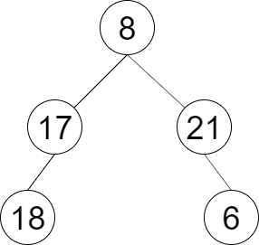

# 彩灯装饰记录 II

一棵圣诞树记作根节点为 `root` 的二叉树，节点值为该位置装饰彩灯的颜色编号。请按照从左到右的顺序返回每一层彩灯编号，每一层的结果记录于一行。

## 示例 1:

>
>### 输入:
>root = [8,17,21,18,null,null,6]
>### 输出:
>[8,[17,21],[18,6]]

## 代码：
1.

    public class Solution {
        public IList<IList<int>> DecorateRecord(TreeNode root) {
            IList<IList<int>> result=new List<IList<int>>();
            if(root==null){
                return result;
            }
            Queue<TreeNode> queue=new Queue<TreeNode>();
            queue.Enqueue(root);
            while(queue.Count>0){
                IList<int> num=new List<int>(); 
                int size=queue.Count;          
                for(int i=0;i<size;i++){
                    TreeNode node=queue.Dequeue();
                    num.Add(node.val);
                    if(node.left!=null){
                        queue.Enqueue(node.left);
                    }
                    if(node.right!=null){
                        queue.Enqueue(node.right);
                    }
                }
                result.Add(num);
            }    
            return result;
        }
    }
2.

    public class Solution {
        public IList<IList<int>> DecorateRecord(TreeNode root) {
            IList<IList<int>> levelOrderTraversal = new List<IList<int>>();
            if (root == null) {
                return levelOrderTraversal;
            }
            Queue<TreeNode> queue = new Queue<TreeNode>();
            queue.Enqueue(root);
            while (queue.Count > 0) {
                IList<int> levelValues = new List<int>();
                int size = queue.Count;
                for (int i = 0; i < size; i++) {
                    TreeNode node = queue.Dequeue();
                    levelValues.Add(node.val);
                    if (node.left != null) {
                        queue.Enqueue(node.left);
                    }
                    if (node.right != null) {
                        queue.Enqueue(node.right);
                    }
                }
                levelOrderTraversal.Add(levelValues);
            }
            return levelOrderTraversal;
        }
    }
3.

    public class Solution {
        public IList<IList<int>> DecorateRecord(TreeNode root) {
            IList<IList<int>> res = new List<IList<int>>();
            if(root == null) return res;
            Queue<TreeNode> queue = new Queue<TreeNode>();
            queue.Enqueue(root);
            int levelNum = 1, num = 0;
            while(queue.Count > 0)
            {
                IList<int> list = new List<int>();
                num = 0;
                for(int i=0;i<levelNum;i++)
                {
                    if(queue.Count > 0)
                    {
                        TreeNode node = queue.Dequeue();
                        list.Add(node.val);
                        if(node.left!=null)
                        {
                            num++;
                            queue.Enqueue(node.left);
                        }
                        if(node.right!=null)
                        {
                            num++;
                            queue.Enqueue(node.right);
                        }
                    }
                    else break;
                }
                levelNum = num;
                res.Add(list);
            }
            return res;
        }
    }
